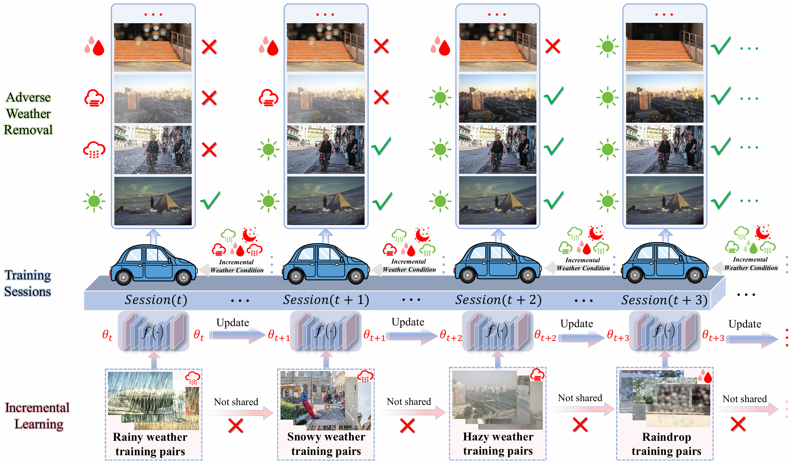

# ILAWR: Incremental Learning Adverse Weather Removal

<a href='https://openaccess.thecvf.com/content/CVPR2025/papers/Lu_Continuous_Adverse_Weather_Removal_via_Degradation-Aware_Distillation_CVPR_2025_paper.pdf'></a> &nbsp;&nbsp;
<a href='https://github.com/xin1u/ILAWR'></a> &nbsp;&nbsp;

This is the official PyTorch implementation of the paper:

>**Continuous Adverse Weather Removal via Degradation-Aware Distillation**<br>
>Xin Lu, Jie Xiao, Yurui Zhu, Xueyang Fu<sup>&dagger;</sup><br>
>University of Science and Technology of China (USTC)<br>
>CVPR 2025




## :wrench: Dependencies and Installation

```bash
git clone https://github.com/xin1u/ILAWR.git
cd ILAWR
pip install -r requirements.txt
```

**Main dependencies:** PyTorch >= 1.10, torchvision, numpy, Pillow, opencv-python, einops


## :file_folder: Project Structure

```
ILAWR/
    ├── assets/                        # Figures
    ├── ckpt/                          # Pre-trained checkpoints
    ├── datasets/                      # Dataset loading
    │   ├── weather_data.py            # All weather dataset classes
    ├── loss/                          # Loss functions
    │   ├── perceptual.py              # VGG-19 contrastive perceptual loss
    │   └── distillation.py            # DAM & reconstruction distillation losses
    ├── networks/                      # Model architectures
    │   ├── restoration_net.py         # FFA-style backbone with global residual
    │   ├── degradation_aware.py       # Degradation-Aware Module (DAM)
    │   └── aggregation.py             # Importance-Guided Aggregation (IGAM)
    ├── utils/
    │   ├── metrics.py                 # PSNR / SSIM computation
    │   ├── scheduler.py               # Cosine decay learning rate
    │   └── helpers.py                 # Directory & checkpoint utilities
    ├── damd_trainer.py                # DAMD training engine (Algorithm 1)
    ├── train_ilawr.py                 # Training entry point
    └── test_ilawr.py                  # Inference & evaluation script
```


## :surfer: Quick Start

**Step 1: Download Checkpoints**

Download the pre-trained checkpoint and place it in the `ckpt/` directory:
- `best_model.pk` — Final weather removal model (last session)

**Step 2: Run Testing**

```bash
python test_ilawr.py \
    --task_order haze rain snow \
    --ckpt_path ./ckpt/best_model.pk \
    --data_path /path/to/datasets/ \
    --device cuda:0 \
    --save_images
```

Restored images are saved in `./results/`. Per-image PSNR and SSIM are printed.


## :muscle: Train

### Setting 1: Haze → Rain → Snow (Synthetic)

```bash
python train_ilawr.py \
    --task_order haze rain snow \
    --steps 500000 \
    --eval_step 20000 \
    --device cuda:0 \
    --lr 0.00005 \
    --alpha1 0.3 \
    --alpha2 0.2 \
    --lam 0.3 \
    --zeta 0.4 \
    --data_path /path/to/data/ \
    --bs 3 \
    --crop_size 256 \
    --exp_name setting1_haze_rain_snow
```

### Setting 2: Haze → Rain → Snow → Raindrop (Synthetic)

```bash
python train_ilawr.py \
    --task_order haze rain snow raindrop \
    --steps 500000 \
    --eval_step 20000 \
    --device cuda:0 \
    --lr 0.00005 \
    --data_path /path/to/data/ \
    --bs 3 \
    --crop_size 256 \
    --exp_name setting2_4tasks
```

### Setting 3: Real-World (Haze → Rain → Snow → Low-Light)

```bash
python train_ilawr.py \
    --task_order Real_haze Real_rain Real_snow Real_lol \
    --steps 100000 \
    --eval_step 1000 \
    --device cuda:0 \
    --lr 0.00005 \
    --data_path /path/to/data/ \
    --bs 3 \
    --crop_size 256 \
    --exp_name setting3_real
```


## :file_folder: Datasets

We use the following datasets for training and evaluation:

| Degradation | Synthetic Dataset | Real-World Dataset |
|-------------|------------------|--------------------|
| Haze | [RESIDE](https://sites.google.com/view/raboron/datasets/reside) (SOTS outdoor) | [REVIDE](https://github.com/BookerDeWitt/REVIDE) |
| Rain | [Rain100H](https://www.icst.pku.edu.cn/struct/Projects/joint_rain_removal.html) | [SPA+](https://github.com/stevewongv/SPANet) |
| Snow | [Snow100K](https://sites.google.com/view/yunfuliu/desnownet) | [RealSnow](https://sites.google.com/view/yunfuliu/desnownet) |
| Raindrop | [Raindrop](https://github.com/rui1996/DeRaindrop) | — |
| Low-Light | — | [LOL-v2](https://github.com/flyywh/CVPR-2020-Semi-Low-Light) |


## :book: Citation

If you find our repo useful for your research, please consider citing our paper:

```bibtex
@InProceedings{Lu_2025_CVPR,
    author    = {Lu, Xin and Xiao, Jie and Zhu, Yurui and Fu, Xueyang},
    title     = {Continuous Adverse Weather Removal via Degradation-Aware Distillation},
    booktitle = {Proceedings of the IEEE/CVF Conference on Computer Vision and Pattern Recognition (CVPR)},
    year      = {2025}
}
```


## :postbox: Contact

Please feel free to contact us if there is any question (luxion@mail.ustc.edu.cn).
